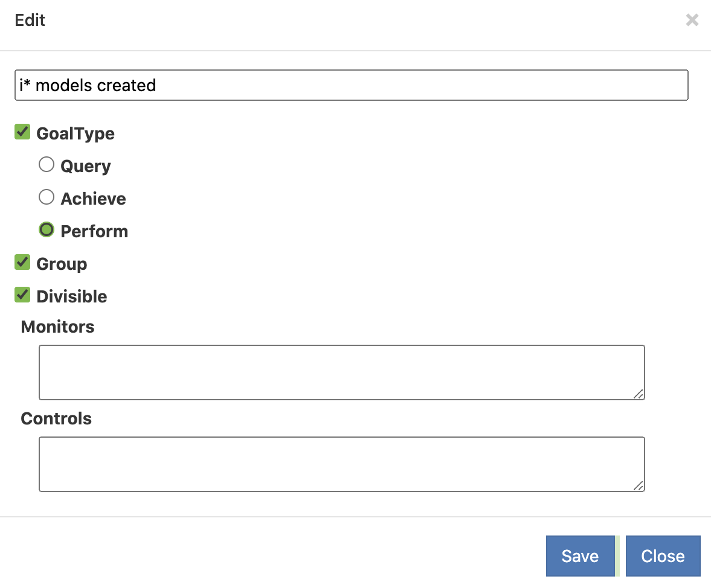

# PistarModelFactory 

 Pistar is an open-source goal modelling tool. Its key distinguishing characteristics are:
  - it runs entirely on the browser, thus no installation needed
  - high visual fidelity (we want your diagrams to be pretty, even when printed)
  - supports the [iStar 2.0 standard](https://sites.google.com/site/istarlanguage/)

Pistar Model Factory uses the Pistar modeling tool and combines objective modeling with software product line techniques.

## Enviromment Configuration File

The environment configuration file is a json file that has fundamental attributes to ensure that different functionalities can be activated from the model generated by Pistar.

The configuration file structure is constructed by the following attributes: environment, buttons and properties.
       {
          "enviromment": String,
          "buttons": Array<Buttons.class>
          "properties": Array<Properties.class>
       }
 
### Enviromment Classes
 
 
      InputFile = {
         "type": InputFileTypeEnum.class,
         "attributeName": String
      }
 
 
     Service = {
         "method":  String,
         "url":  String,
         "resultNameFile":  String,
         "inputs": Array<InputFile.class>
      }
 
 
      InputFileTypeEnum = {
         FILE: "FILE",
         IMAGE: "IMAGE"
      }
 
      ElementTypeEnum = {
         GOAL: "GOAL",
         TASK: "TASK",
         QUALITY: "QUALITY",
         ACTION: "ACTION"
      }

      TypesAttributesEnum = {
         BOOLEAN: "BOOLEAN",
         CHECKBOX: "CHECKBOX",
         RADIO_BUTTON: "RADIO_BUTTON",
         EXPRESSION: "EXPRESSION",
         LIST: "LIST",
         OBJECT: "OBJECT",
         OBJECT_NULLABLE: "OBJECT_NULLABLE",
         OBJECT_SELECTABLE: "OBJECT_SELECTABLE",
         TEXT: "TEXT"
      }

### Enviromment

The attribute environment defines the name of the environment that will be loaded.

### Buttons
 
      {
         "id": String,
         "label":  String,
         "service": Service.class
      }

The attribute buttons represent the buttons on the menu that will trigger some service
 

 
### Properties

    {
         "name": String,
         "value": String,
         "placeholder": String,
         "checked": Boolean,
         "hide":Boolean,
         "type": TypesAttributesEnum.class,
         "elementType": ElementTypeEnum.class,
         "childrens": Array<Properties>
    }
 
 
The attribute properties represent the properties displayed in the elements. 
 - name : The name of property
 - value : The value of property
 - placeholder : The name displayed in input 
 - checked : The boolean that represent the selected input
 - hide : The boolean that show or hide the property
 - type: The property type
 - elementType: The type of element selected
 - childrens: The childrens of property
 

